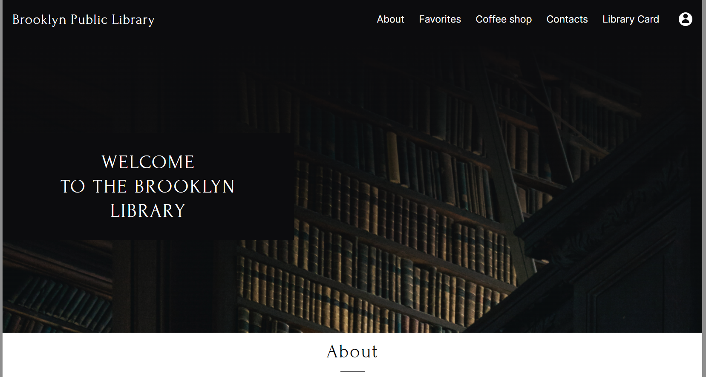

# Portfolio

## My CV

* Deploy: [CV MIU](https://miu-cz.github.io/Portfolio/my-cv/)

===============================

## Brooklin Library - layout

* Deploy: [Brooklin-library](https://miu-cz.github.io/Portfolio/Brooklin-library/)

===============================

## Loopstudios landing page solution - for Frontend Mentor with Vue.JS & SCSS

* Deploy: [landing page](https://miu-cz.github.io/Portfolio/loopstudios-Vue/new-loopstudios/dist/)
* Sourse: [github](https://github.com/MIU-cz/Portfolio/tree/gh-pages/loopstudios-Vue/new-loopstudios/dist)

===============================

## Snake - JS + Canvas

* Deploy: [Snake](https://miu-cz.github.io/Portfolio/snake/)
